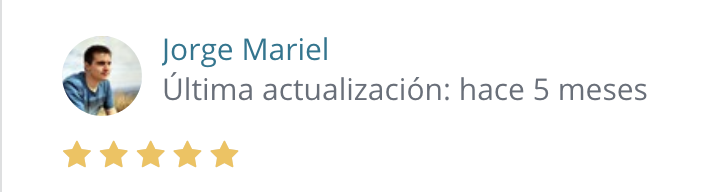
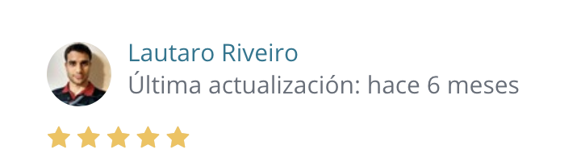

This course introduces you in a simple way and without many technicalities to the development of web applications with Javascript and the React library. Taking a practical and direct approach, and through the step-by-step development of four projects, we show you the keys to development with React.

This course is divided into six sections. In each section we delve a little each time so that at the end you end up with a solid and clear knowledge of how to start and continue with a web application developed with React.

### Points covered:

- React and Next.js (a brief introduction)
- Installing dependencies with npm
- Implementation of external libraries.
- Handling of external CSS and CSS-in-JS
- styled-components
- ES6 Syntax
- Async - Await
- localStorage
- React-Redux
- Unpick Production on Now, Netlify and Heroku

> "Excelente curso para empezar con React. No es un curso profesional pero te ayuda a crear las bases. Al terminar te quedas con la sensación de que entiendes como funciona pero con muchas cosas inconclusas. Esto no es malo ya que el curso apunta a iniciarte. Ahora me toca seguir programando :)"

> "Buen curso. Buenas clases, son entretenidas y hay mucho por aprender. Gracias!"

[Sign up for my course with a special price of $13.99, only for this month. This course is in Spanish.](https://www.udemy.com/course/introduccion-a-react/?couponCode=67F70E4AF8903369DA43)
