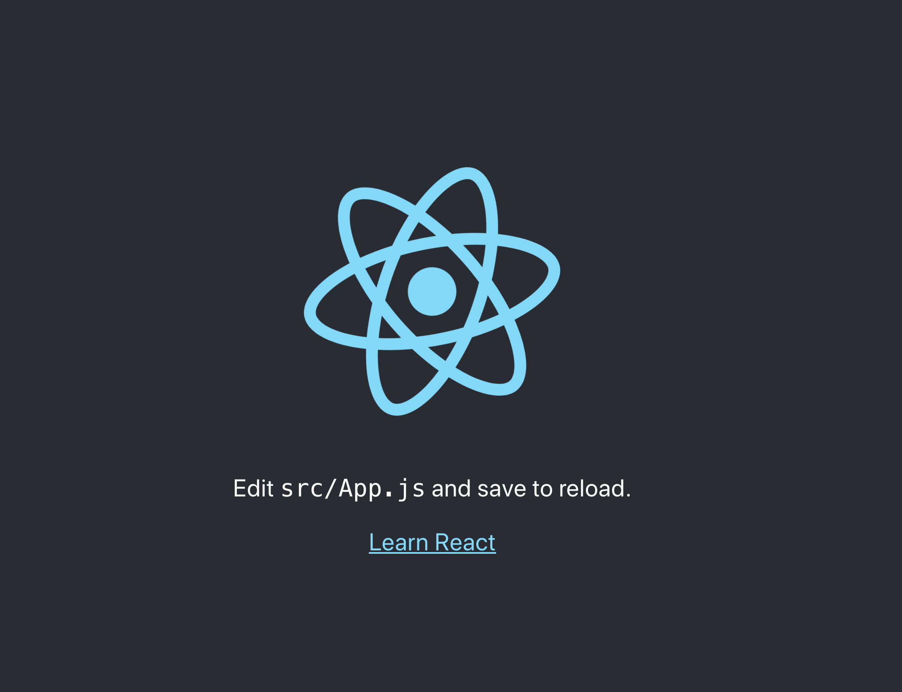
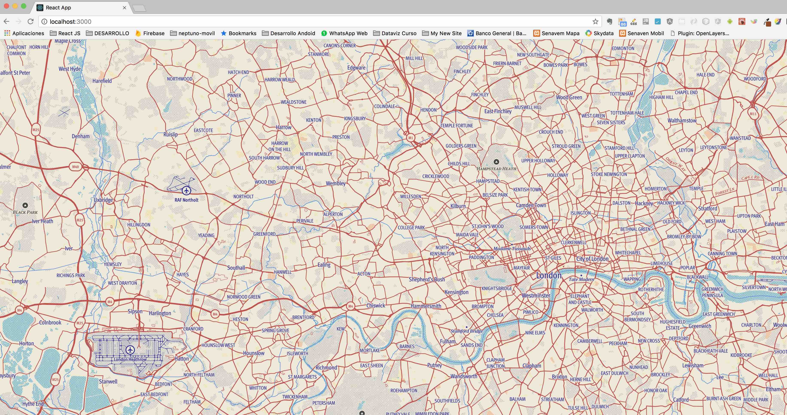

## Introdution

It is always exciting to start creating something new. The profession of web application programming has these two peculiarities: exciting and frustrating. Exciting because every time we write lines of code to create a feature and get it to work and do what we expected, we feel a wave of refreshing gratification; however, frustrations will always be around the corner.

In all my personal learning experience in this field I have noticed that those teaching resources that were most effective for me were characterized by a zero start methodology. In other words, that everything was built from nothing, that nothing was assumed. Every time I looked for a tutorial or a blog that explained how to make or build something, I preferred those resources that started with the title in English: "from scratch", that is, from scratch.

Perhaps this is not the case for everyone, since everyone has their own preferences about the best way to learn something. In any case, I consider that, in general, it is always preferable to give the opportunity to fully understand something from its basic foundations.

## What are we going to build

We are going to create a web application, using the increasingly pupular **Node.js** library, **Mapbox** and **styled-components** as the basis for the UI (User Interface). We are going to require a development environment with Node.js.

## Step One: verify Node.js installation

Node.js is a server development environment platform for running Javascript. This demo application is not going to have a server component, but we are going to use the yarn package handler. So first we go to the Node.js website and follow the instructions to download and install Node.js. To verify the installation of Node.js, on the command line, we run:

```cmd
node -v
```

and the result should be something like:

```cmd
v12.16.1
```

## Step Two: Install yarn (optional)

Now we head to the yarn website. You can go to this link: https://classic.yarnpkg.com/en/docs/install/#mac-stable. There you can find instruction on how to install it. In case you prefer to use npm instead of yarn, it is not necessary to follow this step.

We confirm the yarn installation:

```cmd
yarn -v
```

..and the result should be something like this:

```cmd
1.17.3
```

## Step Three: Start the project folder

We created a particular folder or directory and within it we generate the necessary files for the initial configuration:

```cmd
mkdir demo
cd demo
yarn create react-app client
```

This last procedure will create the files in the subfolder clientThis is the preferred strategy to quickly start writing code in a React application. We check that everything is fine by running the test server by:

```cmd
cd client
yarn start
```

The default browser must be opened on our system, at the address localhost: 3000:



Then, in our favorite code editor, we open the client project folder.

## Step Four: install the necessary dependencies

Empezamos por instalar las siguientes dependencias:

### styled-components

Styled-components is a dependency that unites the use of literal templates in Javascript and the power of CSS to create and attach styles to React components. This is one of the many alternatives to directly incorporate CSS properties in Javascript files, a trend known as CSS-in-JS. Styled-components is one of the most popular and used. Personally, it is my preferred option.

```cmd
yarn add styled-components
```

## Mapbox

Mapbox, an impressive library to implement dynamic maps in web and mobile applications. It has an implementation for React Native as well. Mapbox is commercial, and it is not cheap, but it has a free layer that can be used for the development of demo, public or prototype applications.

```cmd
yarn add react-mapbox-gl mapbox-gl
```

In this way we install two dependencies that are required to implement Mapbox. Next, we will have to go to the Mapbox website to create a user account that allows us to use a free trial token.

## Paso Cinco: implementar la vista del mapa

Next we replace all the content of the App.js file that is inside the src folder with:

```js
import React, { Component } from 'react';
import ReactMapboxGl from 'react-mapbox-gl';

const Map = ReactMapboxGl({
  accessToken: 'aqui va tu default public token'
});

class App extends Component {
  render() {
    return (
      <Map
        style="mapbox://styles/gliberte/cjj69dxbs18lb2snnh2qainzi" //debes reemplazar esto
        por
        un
        estilo
        propio
        containerStyle={{
          height: '100vh',
          width: '100vw'
        }}
      />
    );
  }
}

export default App;
```

The browser will update with this view:



## Step Six: Adding data layers

We are now going to add a couple of layers of data on top of our basemap. To do this, we will try the simplest procedure. First we will create our own data through an external service. This is the geojson.io site. This web application allows us to create data in geojson format that we can then save and download as files to our computer. We generate a file that we call data.geojson (note the extension geojson, a json-based specification that allows geospatial data description), and place it in the project's base folder. Then we import the following components:

```js
import ReactMapboxGl,{Layer,Source}  from 'react-mapbox-gl'
import MisRiosData from './data.geojson'

    ...
    class App extends Component {
        render() {
            const geojsonOptions = {
                type:'geojson',
                data:MisRiosData
            }
            return (
                <Map
                    style="mapbox://styles/gliberte/cjj69dxbs18lb2snnh2qainzi"//debes reemplazar esto por un
                    estilo propio
                    containerStyle={{
                        height:"100vh",
                        width:"100vw"
                    }}
                >
                    <Layer
                        type="line"
                        paint={
                            {
                            "line-color":"#42A5F5",
                            "line-width":4
                            }
                        }
                        sourceId="rios"
                    />
                    <Source id="rios" geoJsonSource={geojsonOptions}/>
                </Map>
            );
        }
    }
```

The geojson data stored in data.geojson is imported into the MisRiosData bind, which is then passed as the geoJsonSource property to the Source component. The properties that we can configure for the Layer and Source components are documented on the site https://github.com/alex3165/react-mapbox-gl/blob/HEAD/docs/API.md. These properties in turn refer to the documentation found on the Mapbox site https://www.mapbox.com/mapbox-gl-js/api/.

If we look in the browser, at this moment the map should show the new loaded data layer. A more direct and brief way, however, to do this is by using the specialized GeoJSONLayer component. All we have to do is import this component and replace the Layer and Source components with:

```js
<GeoJSONLayer
  data={MisRiosData}
  linePaint={{
    'line-color': '#42A5F5',
    'line-width': 4
  }}
  symbolLayout={{
    'text-field': '{nombre}',
    'symbol-placement': 'line',
    'text-offset': [0, -1]
  }}
/>
```

The result will be the same. In my case, the type of geographic layer that I created in geojson.io is lines.


